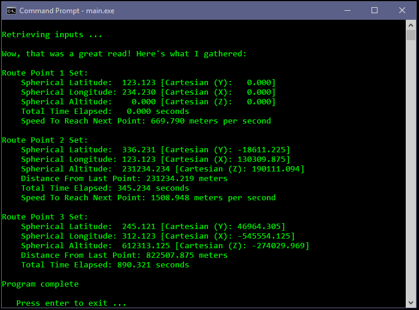

# charter-plane


## Synopsis
Feed this program spherical route points (latitude, longitude and altitude) and a total elapsed time at each point. For each input point it will calculate correlated Cartesian coordinates. It will use the Cartesian points to calculate the distance between each route point and the average speed between each point.


## Inputs
Inputs should be written into the inputs.txt file in the root folder with each route point on it's own line. Each input value should be preceded by a space (including the first input) using this order:
```
 [latitude] [longitude] [altitude] [total time elapsed]
```

An example for inputting 3 route points in inputs.txt:
```
 123.123 234.230 0.000 0.000
 336.231 123.123 231234.234 345.234
 245.121 312.123 612313.122 890.321
```

Notes: 
<ul>
  <li>Latitude and longitude are read in as degrees and limited to a range of 0 to 360.</li>
  <li>Altitude is assumed to be in meters and is limited to values less than 10^6.</li>
  <li>Total elapsed time is assumed to be input in seconds and will be limited to values of 0 and above.</li>
  <li>There may be as many as 30 route points.</li>
  <li>All inputs may be defined with a precision of up to 3 decimal points.</li>
</ul>


## Build and run
To recompile the program with Visual Studio Command Prompt (on Windows):
<ol>
  <li> Open the VS Command Prompt: Start Menu -> Visual Studio [version] -> Developer Command Prompt</li>
  <li> Navigate to the root directory in the command prompt</li>
  <li> Enter this command: <strong>cl src/main.c src/process_inputs.c src/calculate.c</strong></li>
  <li> Then run the program with this command: <strong>main</strong></li>
</ol>


## Output
Outputs are written to the console. Running the program with the above inputs produces this output:

